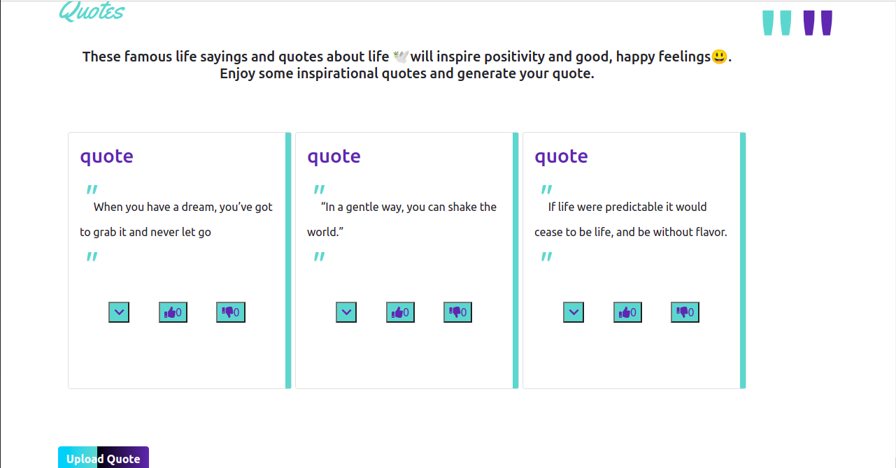

# Quotes App

### By: Brigid Chepkemoi

## Description

This is an Angular project application that users can generate quotes, upload quotes, vote and downvote quotes to their liing. They can also delete quotes

## Live Link

## Setup/Installation Requirements
install angular CLI in your terminal
Run ng serve for a dev server. Navigate to http://localhost:4200/. The app will automatically reload if you change any of the source files.

## BDD

The user is able to;

- View recent votes

- Share their quote

- Upvote or Downvote a quote

- Delete a quote

## Technologies

- HTML5
- CSS3
- Boostrap
- JavaScript
- Angular
- Typescript

## Licence

MIT License

Copyright (c) Brigid Chepkemoi- [MIT Licence](LICENSE)
Permission is hereby granted, free of charge, to any person obtaining a copy
of this software and associated documentation files (the "Software"), to deal
in the Software without restriction, including without limitation the rights
to use, copy, modify, merge, publish, distribute, sublicense, and/or sell
copies of the Software, and to permit persons to whom the Software is
furnished to do so, subject to the following conditions:
The above copyright notice and this permission notice shall be included in all
copies or substantial portions of the Software.
THE SOFTWARE IS PROVIDED "AS IS", WITHOUT WARRANTY OF ANY KIND, EXPRESS OR
IMPLIED, INCLUDING BUT NOT LIMITED TO THE WARRANTIES OF MERCHANTABILITY,
FITNESS FOR A PARTICULAR PURPOSE AND NONINFRINGEMENT. IN NO EVENT SHALL THE
AUTHORS OR COPYRIGHT HOLDERS BE LIABLE FOR ANY CLAIM, DAMAGES OR OTHER
LIABILITY, WHETHER IN AN ACTION OF CONTRACT, TORT OR OTHERWISE, ARISING FROM,
OUT OF OR IN CONNECTION WITH THE SOFTWARE OR THE USE OR OTHER DEALINGS IN THE
SOFTWARE.